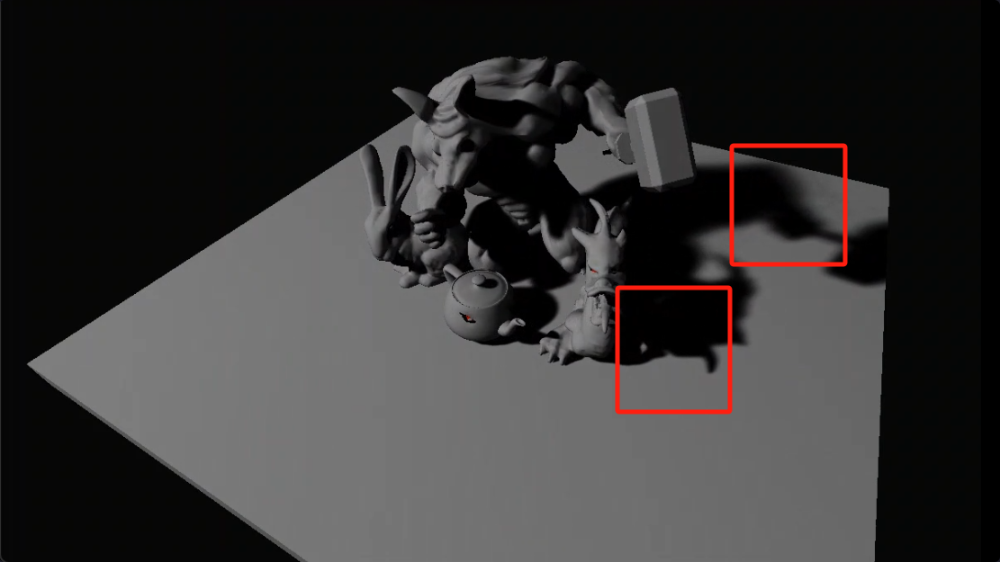
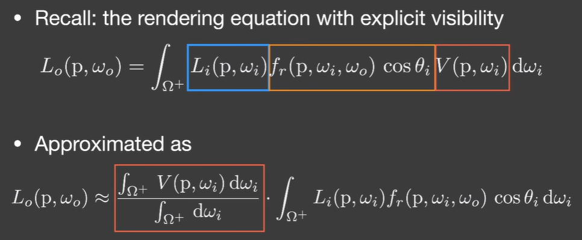
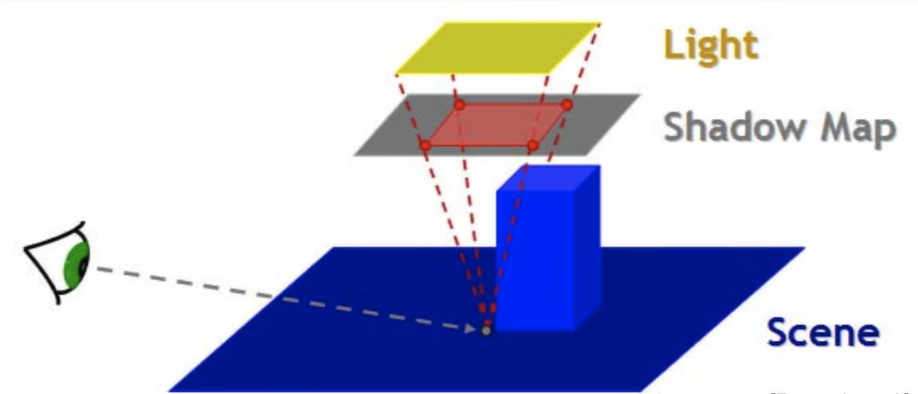
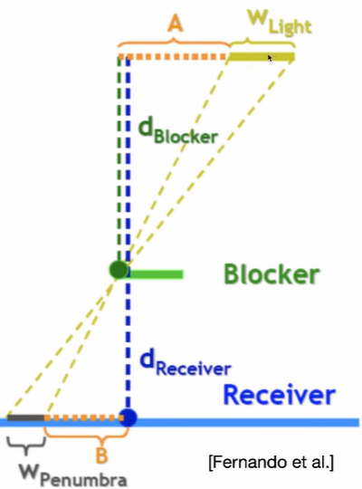
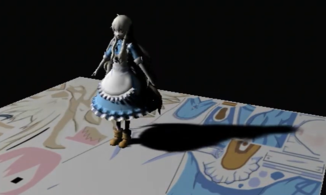
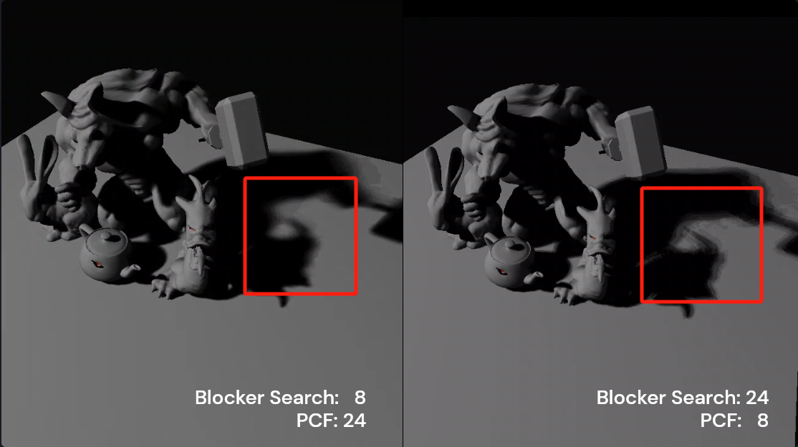

# Vulkan实现PCSS过程记录

## 1. Preliminary
PCSS的想法有着渲染方程理论的支撑。说白了PCSS就是做阴影的，而阴影就与渲染方程中的Visibility项相关。为了计算的简化，我们将Visibility项从积分中拆出来，留下的部分就是unshadowed的渲染。  

而PCSS要计算的就是阴影值 $ value_{shadow}=\frac{\int_{\Omega ^{+}}V(p,\omega_i) \, d\omega_i}{\int_{\Omega ^{+}} \, d\omega_i} $。PCF将边缘处的$ value_{shadow}$全部filter到0和1之间，而PCSS则要考虑边缘不同的filter强度，以控制阴影的强弱。
## 2. Algorithm
软阴影从何而来？实际就是现实中的光源并不是理想点光源，因此会有半影区的存在。而半影区的大小和遮挡物距离、光源大小、接受物距离均有关。
### 2.1 Block Search
**return avgBlockDepth**  
由于我们事先不知道遮挡物是谁，因此最简单的方法就是一片区域内都查找一遍求平均。而如何确定查找范围呢？

图示很清晰，将shadow map放在光源的近平面处，根据相似三角形即可确定查找区域。注意这一步计算是在世界坐标系进行的，而对纹理的查询是在uv坐标下进行的，因此还要除以近平面的大小将搜索半径转变到0-1之间。

确定了搜索半径，我们就可以在该区域内采样，并得出平均遮挡深度了。注意在将frag的深度和采样点深度比较时，只有发生遮挡时我们才保留。我们计算的是遮挡物的平均深度，而不是搜索区域的平均深度。
```glsl
float findAvgBlockerDist(vec4 shadowCoord, float size) {
	int sampleNum = coe.block_pcf_visualize_pad[0];
	float avgBlockDist = 0.0f;
	int cnt = 0;
	for (int i = 0; i < sampleNum; i++) {
		if ( shadowCoord.z > 0.0 && shadowCoord.z < 1.0 ) {
			vec2 _sample = possionSamples.samples[i].xy * size + shadowCoord.xy;
        	float dist = texture(shadowMap, _sample).r;
			if ( dist < shadowCoord.z ) {
				avgBlockDist += LinearizeDepth(dist) * ubo.zFar;
				cnt += 1;
			}
		}
    }
	return (cnt == 0) ? LinearizeDepth(shadowCoord.z) * ubo.zFar : avgBlockDist / cnt;
}
```
### 2.2 Penumbra Estimation
**return penumbra_size**  
如下图，有了平均遮挡深度，我们就可以通过相似三角形估计出半影区域的大小$w_{penumbra}=(d_{receiver}-d_{blocker})*w_{light}/d_{blocker}$  

### 2.3 Percentage Closer Filtering
**return value_shadow**  
最后根源半影大小进行一步PCF就好啦。
## 3. Vulkan Implementation
这是一个典型的two pass的阴影算法
1. renderpass1  
   经过`vertex shader`-`late fragment test`得到从光源看向世界的深度附件图像
2. renderpass2  
   上一步的深度附件用作采样图像，额外需要一个颜色附件和一个深度附件，其中PCSS算法在片段着色器实现
## 4. Result
对于采样，我使用的近似的泊松采样方法。好处是样本生成简便，同时排除了采样时对pixel的依赖。例如乘以半径r，就得到了半径为r的圆盘中的样本，可以与我们得到的search_size和penumbra_size很好的配合。
```cpp
float ANGLE_STEP = PI2 * static_cast<float>(possionDisk.ringNum) / static_cast<float>(possionDisk.blockerSearchSampleNum);
float INV_NUM_SAMPLES = 1.0f / static_cast<float>(possionDisk.blockerSearchSampleNum);

float angle = rand_2to1() * PI2;
float radius = INV_NUM_SAMPLES;
float radiusStep = radius;
for (int i = 0; i < possionDisk.blockerSearchSampleNum; i++) {
    possionDisk.samples[i].x = glm::cos(angle) * glm::pow(radius, 0.75f);
    possionDisk.samples[i].y = glm::sin(angle) * glm::pow(radius, 0.75f);
    radius += radiusStep;
    angle += ANGLE_STEP;
}
```
两步采样均使用64个样本得到的结果如下

不同程度的降低两步采样数量的结果如下

可以看到保持PCF有较高的采样数对最后的阴影质量很重要
## 4. Reference
1. https://sites.cs.ucsb.edu/~lingqi/teaching/games202.html