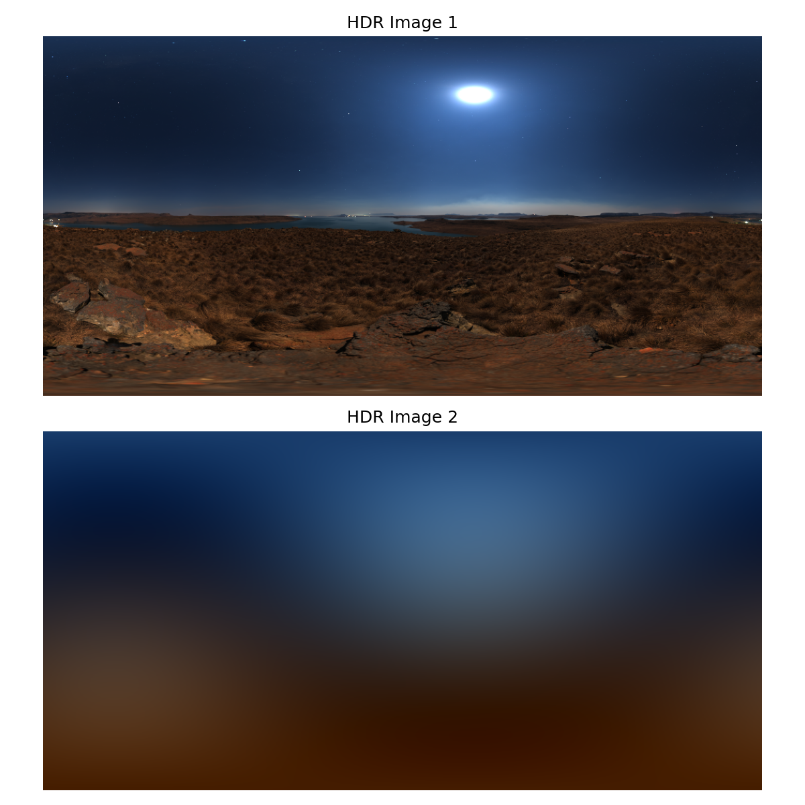
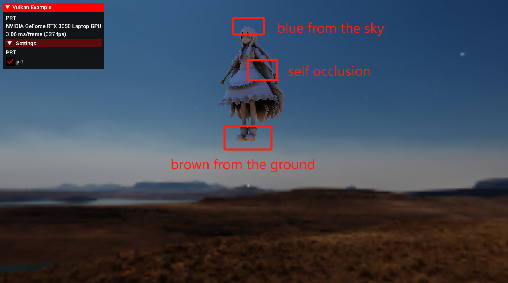
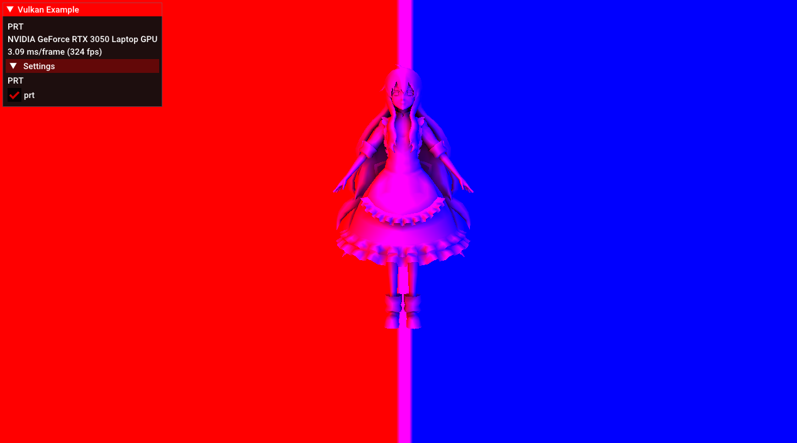

# Vulkan实现简易的PRT
## 前言
PRT思路很简单，就是将rendering equation中的光照项和物体的几何项拆出来分别投影到球谐基函数空间作计算。但是在使用vulkan没有任何轮子的情况下，个人感觉实现还是很麻烦的。对于预计算光照，需要了解球谐函数、HDR、ToneMapping等相关知识；对于预计算几何项，需要有配套的光追轮子和考虑自定义顶点数据的存储；对于实时渲染过程，又需要考虑球谐函数的旋转，而这却不是一个trivial的问题。由于本菜鸡实力有限，暂且未实现考虑inter-reflection的预计算传输和球谐旋转。

## 预计算光照
此模块通过python的numpy库实现，可以通过蒙特卡洛采样来逼近投影系数，对于立方体贴图也可以通过立体角的投影直接估算积分。由于比较简单，直接上结果

## 预计算传输
此部分我采取的是为每一个顶点计算一个投影系数，利用vulkan的光追管线进行计算，伪代码如下
```
for vertex in vertices:
    update vertex.pos to uniform buffer
    vkCmdFillBuffer // 清空storage buffer
    vkCmdTraceRaysKHR // 进入光追管线加速计算
    memcpy storage buffer to host storage buffer
```
在不考虑自反射的情况下，我们只需要使用rgen和rmiss shader。其中miss shader逻辑很简单，如果未相交hitValue置1否则置0。对于rgen shader，LaunchSize的总大小即为蒙特卡洛采样的样本数，伪代码如下
```
if (sample.idx >= sampleNum) {
	return;
}
x, y, z = sample.x, sample.y, sample.z; // 位于单位球面
direction = vec3(x, y, z);
xx = x*x, yy = y*y, zz = z*z, xy = x*y, yz = y*z, zx = z*x;
cos = max(0.0f, dot(vertex.normal, direction));
if (cos < EPS) {
	return;
}

hitValue = 0.0f;
traceRayEXT(topLevelAS, gl_RayFlagsSkipClosestHitShaderEXT, 0xff,0, 0, 0, vertex.pos, tmin, direction, tmax, 0);
if (hitValue < EPS) {
	return;
}

atomicAdd(shResult.sh[0], cos * shCoe[0]);
atomicAdd(shResult.sh[1], cos * shCoe[1] * y);
atomicAdd(shResult.sh[2], cos * shCoe[2] * z);
atomicAdd(shResult.sh[3], cos * shCoe[3] * x);
atomicAdd(shResult.sh[4], cos * shCoe[4] * xy);
atomicAdd(shResult.sh[5], cos * shCoe[5] * yz);
atomicAdd(shResult.sh[6], cos * shCoe[6] * (3 * zz - 1));
atomicAdd(shResult.sh[7], cos * shCoe[7] * zx);
atomicAdd(shResult.sh[8], cos * shCoe[8] * (xx - yy));
```
## 实时计算环境光
这一部分就是典型的光栅管线了，我们只需要顶点位置、UV、球谐投影系数即可。对于每一个fragment，插值得到球鞋投影系数，并与预计算的光照投影系数作点积即可，最后记得要乘以diffuse brdf。



最后实力和时间有限只实现到这里，勉强达到games202作业水准了。至于现代引擎中更复杂的PRT技术以后有机会再探索（马上滚去学ue了）
## Reference
1. [Spherical Harmonic Lighting: The Gritty Details](https://www.cse.chalmers.se/~uffe/xjobb/Readings/GlobalIllumination/Spherical%20Harmonic%20Lighting%20-%20the%20gritty%20details.pdf)