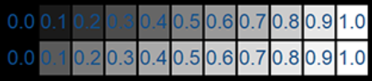

# Gamma矫正全流程
有关gamma矫正和色彩的那些事[这篇文章](https://zhuanlan.zhihu.com/p/609569101)讲的很清晰，因此不再赘述。本文基于个人理解主要记录和补充了**一张图片从拍摄到显示到人眼中究竟经过了哪些变换**。
## 1 人眼
还是先从人眼说起。大家如果看过有关gamma矫正的文章应该都知道亮度分为物理亮度和感知亮度。如下图，物理亮度在物理意义上均匀变化时（如常用的nit单位）人眼感知到的亮度却不是均匀的，我们会觉得右半边好像亮度变化不大。而在我们的感知中，图中第一行才是我们认为的均匀亮度。图中0.5的物理亮度在我们的感知线性变化亮度中处于大概0.7的位置，这也是为什么我们对于亮度较高时的变化不敏感。  
  
这一步我们可以认为人眼自动应用了一个非线性变换，将物理世界线性的亮度转变为非线性的亮度，而这个非线性亮度在我们的感知世界中是线性的，我们称为gamma空间。我们记线性空间为P，Gamma空间为G，则这一步变换为  
\[
f: P \rightarrow G,\space x \mapsto x^{\frac{1}{2.2}}
\]
## 2 屏幕
如果你了解一些图形API，那应该对framebuffer帧缓冲这个概念不陌生。帧缓冲中存储的是位于Gamma空间中的图像，最终被呈现到屏幕上并转化为物理单位上的光信号，我们才能看到屏幕上的内容。那如何定义从颜色转换到光强，或者说从电压转换到光强的函数呢？EOTF（Electro-Optical Transfer Function，电光转换函数）。对于sRGB格式的图像来说，EOTF的定义如下  
\[
EOTF_{sRGB}: G \rightarrow P,\space x \mapsto x^{2.2}
\]
显然，有
\[
EOTF_{sRGB}=f^{-1}
\]
因此考虑从帧缓冲到屏幕再到人眼的全过程，EOTF和f刚好抵消，相当于framebuffer中记录的就是我们感知中“线性”的颜色。
## 3 相片
接下来我们再讨论一下图片的生成。这里我们认为图片是相机拍摄得到的，而非合成的。相机通过感光元件将物理时间的光转换为电信号存储起来。设想一下如果我们之间存储不经任何处理会发生什么？例如，我们拍摄得到的相片未经处理直接存为jpg图片，当我们要在屏幕上显示照片时，照片中的数据被读取到帧缓冲中。而在第2部分我们说过帧缓冲中存储的是位于Gamma空间中的图像，这样以来就出了问题。因此我们需要提前将图片转换到Gamma空间，即在拍摄后将图片应用一次OETF再存储起来。
\[
OETF_{sRGB}: P \rightarrow G,\space x \mapsto x^{\frac{1}{2.2}}
\]
## 4 总结
将文章倒过来看便是整个变换的流程。
1. 相机将光从线性空间转换为Gamma空间并存储起来；
2. 帧缓冲读取存入处于Gamma空间的图片；
3. SDR显示屏显示时将图片从Gamma空间转换为线性空间的光；
4. 人眼最终将线性空间的光转换为Gamma空间中我们感知的图片。  

而对于PBR等需要进行物理正确的计算的流程，我们必须在线性空间进行计算，因为这才符合物理规律。由此引入了线性工作流的概念，即在1、2步之间插入线性工作流，读取Gamma空间的图片后我们首先将其变换为线性空间，做完物理计算后，再变换为Gamma空间，然后衔接原来的第2步。  
不过要注意一点，PS中的颜色混合直接在Gamma空间中进行，因为这符合人眼的感知规律。因此在线性工作流中作alpha blending时，如果不做处理则会得到和PS不一样的结果。具体解决办法很简单，对于要混合的图像，我们不再转变到线性空间，保证了颜色混合在Gamma空间进行。由于最后图像要统一转变到Gamma空间，而我们混合的图像已经在Gamma空间，我们可以标记不进行转换或者提前将混合后的图像转换到线性空间。