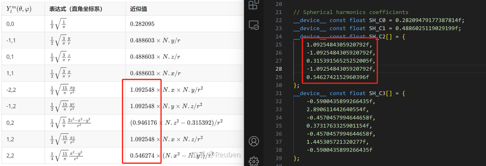

# 从复球谐函数到实球谐函数
# Background
笨人最近在尝试实现PRT的过程中在球谐函数投影上犯了难，虽然之前也用过球谐函数，但这次需要自己实现计算时却发现为什么不同地方的代码实现不一样，同一个基函数有的代码系数前有负号有的没有；并且在看球谐相关博客时十分不解为什么实球谐函数在m不为0时前面有个$\sqrt 2$ 。因此写了本篇文章主要记录实球谐函数究竟怎么来的，如有不对的地方还请指正。
# Introduction
相信看过球谐函数相关文章的uu都知道它是拉普拉斯方程在球坐标系下的解（虽然本工科生看不懂），这里我们先抛开拉普拉斯方程，看一个简单的微分方程  
$\frac{1}{y} \frac{\, d^2 y}{\, d x^2}=-m^2$  
在复数域下，它的解为$y=Ce^{imx}$ ，由指数函数定义  
而在实数域下，它的解为$y=C_1cos(mx)+C_2sin(mx)$，由三角函数系定义  
那要如何从复数解得到实数解呢？欧拉方程！  
$cos(mx)=\frac{e^{imx}+e^{-imx}}{2}$  
$sin(mx)=\frac{e^{imx}-e^{-imx}}{2i}$  
注意这里cos和sin都应该求出来，不然就丢失了实方程解的一部分，毕竟它们是正交的。
# Preliminary
现在我们回到球谐函数，复习一下复球谐函数的相关公式。复球谐函数定义为
$Y_l^m(\theta,\phi)=(-1)^m \sqrt{\frac{2l+1}{4\pi}\frac{(l-|m|)!}{(l+|m|)!}} P_l^m(cos\theta) e^{im\phi}$   
其中$P_l^m$为伴随勒让德多项式，是勒让德多项式$P_l$的m阶导数，那一大坨根号是归一系数。我们着重要关注另一个等式，后续对于求解实球谐函数十分重要  
$Y_l^{-m}(\theta,\phi)=(-1)^m Y_l^{m}(\theta,\phi)^*$  
其中星号*代表复共轭
# From Imagery to Real
首先声明，实球谐函数绝不简单是复球谐函数的实数部分，这是我一直以来的错误观点。从Introduction中的例子也能看出来，如果只取实数部分，则丢失了sin的部分。原因很简单，因为$e^{ix}=cosx+isinx$，cos只出现在实数部分，导致我们丢失了虚部的sin。  
至此我相信读者应该从前面的铺垫能够猜出来如何从复球谐函数求得实球谐函数了：直接暴力套欧拉公式分别提取出cos部分和sin部分，即  

\[
Y_{lm} = 
\begin{cases}
\frac{1}{\sqrt{2}} (Y_l^m+Y_l^{m*}) & \text{if } m > 0, \\
Y_l^m & \text{if } m = 0, \\
\frac{1}{\sqrt{2}} (Y_l^{-m}-{Y_l^{-m}}^*) & \text{if } m < 0.
\end{cases}
\]

这里我们用Y_{lm}以区分实函数。当m大于0时我们提取出了cos，m等于0时本身就是实数，m小于0时提取出了sin。当然如果反过来m大于0时提取sin，m小于0时提取cos，结果是一样的。  
再说一下为什么前面有个根号2呢？因为我们要求的实球谐函数是标准正交基函数，必须满足自身的内积为1，不同基函数的内积为0。当m>0时  

\[
\begin{aligned}
\int_{\Omega}Y_{lm}^2 \, d\omega &= \int_{\Omega}\frac{1}{2}(Y_l^m+{Y_l^{m}}^*)^2\, d\omega \\
&= \frac{1}{2}\int_{\Omega}({Y_l^m}^2+{{Y_l^{m}}^*}^2+2Y_l^m{Y_l^{m}}^*)\, d\omega \\
&= \frac{1}{2}\int_{\Omega}({Y_l^m}^2+{{Y_l^{m}}^*}^2+2(-1)^mY_l^m{Y_l^{-m}})\, d\omega \\
&= \frac{1}{2} (1+1+0) \\
&= 1
\end{aligned}
\]
不难发现前面的系数根号2正是用来标准化基函数的，当m<0时同理。  
**Conclusion**  
至此我们已经成功从复球谐函数求出了实球谐函数，本质就是利用欧拉公式从m>0的部分提取出cos，m<0的部分提取出sin 。而实球谐函数前面多出来的系数根号2实际是用来标准化的。那么还有一个问题，为什么不同地方对于同一个球谐函数的系数的正负号不一致呢？

我个人认为这不是什么大问题，只要全程统一用一组系数就好了。就好比标准正交基$\{i,j,k\}$和$\{-i,-j,-k\}$，只不过是某个球面函数在不同系数正负性的实球鞋基函数空间的坐标的某些分量的正负号不同罢了。
# Reference
1. [SphericalHarmonics_12](https://scipp.ucsc.edu/~haber/ph116C/SphericalHarmonics_12.pdf)
2. [how-are-the-real-spherical-harmonics-derived](https://math.stackexchange.com/questions/145080/how-are-the-real-spherical-harmonics-derived)
3. [wiki](http://en.wikipedia.org/wiki/Spherical_harmonics#Real_form)